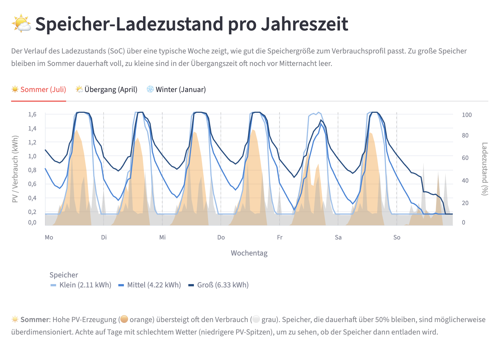

# ☀️ SolarBatterYield - PV-Analyse mit Speichervergleich

https://solarbatteryield.streamlit.app/

Eine interaktive Streamlit-App zur Simulation und Wirtschaftlichkeitsanalyse von Photovoltaik-Anlagen mit
Batteriespeicher – optimiert für **Balkonkraftwerke** und kleine Aufdachanlagen.

  <picture>
    <source media="(prefers-color-scheme: dark)" srcset="assets/app_screenshot_dark.png">
    <source media="(prefers-color-scheme: light)" srcset="assets/app_screenshot_light.png">
    
  </picture>

## Features

- **PVGIS-Integration** – Stündliche PV-Ertragsdaten direkt von der EU-Datenbank (2005–2020)
- **Standortsuche** – Koordinaten per Ortsname via OpenStreetMap Nominatim
- **Flexible PV-Konfiguration** – Beliebig viele Module mit individueller Leistung, Ausrichtung und Neigung
- **Wechselrichter-Limit** – 800 W Standard (Balkonkraftwerk), deaktivierbar für größere Anlagen
- **Lastabhängiger Wechselrichter-Wirkungsgrad** – Realistische Effizienz basierend auf CEC-Daten von 3.000+
  Wechselrichtern:
    - Drei Voreinstellungen: Pessimistisch (P10), Median (P50), Optimistisch (P90)
    - Optional: Eigene Wirkungsgradkurve für Experten
- **DC- und AC-gekoppelte Speicher** – Korrekte Simulation beider Anbindungsarten:
    - **DC-gekoppelt**: Batterie lädt direkt von den PV-Modulen, Wechselrichter-Limit gilt nur für die AC-Seite
    - **AC-gekoppelt**: Wechselrichter begrenzt den gesamten PV-Ertrag, eigener Wechselrichter für die Batterie möglich
- **BDEW H0-Standardlastprofil** – Realistisches Lastprofil mit Unterscheidung nach:
    - Werktagen, Samstagen und Sonn-/Feiertagen
    - Jahreszeiten (Winter, Frühling, Sommer, Herbst)
    - Deutsche Feiertage werden automatisch berücksichtigt
- **Erweiterter Verbrauchsmodus** – Eigene stündliche Lastprofile inklusive:
    - **Wochentag-Unterscheidung**: Unterschiedliche Profile für Werktage, Samstage und Sonn-/Feiertage
    - **Saisonale Skalierung**: Automatische Anpassung der Lastprofile je nach Jahreszeit
    - **Lastverschiebung** – Optionale Zusatzlast an ertragreichen Sonnentagen (z. B. Waschmaschine)
    - **Periodische Zusatzlast** – Regelmäßiger Verbrauch unabhängig vom Wetter (z. B. Warmwasser-Desinfektion)
- **Experten-Verbrauchsmodus** - Upload von eigenen Smart-Meter-Daten (CSV) für präzise Ergebnisse
- **Einspeisevergütung** – Berücksichtigung der Vergütung in allen Wirtschaftlichkeitsberechnungen
- **Mehrere Speicher-Szenarien** – Vergleich von „Ohne Speicher" bis zu beliebig vielen Batterie-Optionen
- **Langzeitvergleich PV vs. ETF** – Kumulierte Rendite über konfigurierbare Laufzeit
- **Konfiguration teilen** – Alle Parameter als komprimierter URL-Parameter

## Bedienung

Die Konfiguration erfolgt über die **Seitenleiste** in fünf aufklappbaren Abschnitten:

| Abschnitt                 | Inhalt                                                                         |
|---------------------------|--------------------------------------------------------------------------------|
| 📍 **Standort**           | Ort suchen oder Koordinaten manuell eingeben                                   |
| 💡 **Verbrauch**          | Jahresverbrauch, Lastprofil, Lastverschiebung, periodische Zusatzlast          |
| ⚡ **PV-System**           | PVGIS-Datenjahr, Systemverluste, Wechselrichter-Limit, Module                  |
| 🔋 **Speicher**           | DC/AC-Kopplung, Lade-/Entladeverluste, SoC-Grenzen, Speicher-Optionen          |
| 💰 **Preise & Vergleich** | Strompreis, Preissteigerung, Einspeisevergütung, ETF-Rendite, Analyse-Horizont |

Nach Eingabe von **Standort** und **Jahresverbrauch** startet die Analyse automatisch.

## Analyse-Ergebnisse

- **Szenario-Übersicht** – Autarkie, Eigenverbrauch, Netzbezug, Einspeisung und Ersparnis pro Szenario
- **Monatliche Energiebilanz** – Gestapeltes Balkendiagramm (Direkt-PV, Batterie, Netzbezug, Einspeisung)
- **Speicher-Ladezustand pro Jahreszeit** - Verlauf des SoC zu unterschiedlichen Jahreszeiten
- **Inkrementelle Analyse** – Mehrwert jeder Ausbaustufe (Δ kWh, Δ €, Amortisation, Rendite)
- **Langzeit-Chart** – PV-Netto-Gewinn vs. ETF über den Analyse-Horizont
- **Zusammenfassung** – Bestes Szenario nach absolutem PV-Gewinn

## Simulationsmodell

Die Simulation läuft stündlich über ein volles Kalenderjahr (8.760 Stunden):

1. **PV-Erzeugung** – PVGIS liefert stündliche DC-Leistung pro Modul
2. **Haushaltslast** – BDEW H0-Profil mit automatischer Unterscheidung nach:
    - **Tagtyp**: Werktag / Samstag / Sonn- und Feiertag
    - **Jahreszeit**: Winter / Frühling / Sommer / Herbst
    - Optional mit Flex- und Periodiklast
3. **Energiefluss** – Pro Stunde in Abhängigkeit der Speicheranbindung:

   **DC-gekoppelt** (Smart-Inverter-Priorität):
    1. Haushaltslast aus PV decken (durch Wechselrichter, ≤ WR-Limit)
    2. Batterie aus überschüssigem DC laden (kein WR-Limit)
    3. Rest über Wechselrichter ins Netz einspeisen (≤ verbleibende WR-Kapazität)
    4. Defizit aus Batterie (durch WR) oder Netz

   **AC-gekoppelt**:
    1. Wechselrichter begrenzt gesamte PV-Leistung
    2. Haushaltslast decken, Überschuss in Batterie oder Netz

4. **SoC-Management** – Saisonale Min-/Max-Ladezustände (Sommer/Winter)

### Sub-stündliche Lastregressionskorrektur

Ein naiver stündlicher Vergleich von PV-Erzeugung und Haushaltslast überschätzt den Eigenverbrauch: Liegt die mittlere
Stundenlast z. B. bei 300 W und die PV bei 400 W, scheint die Last vollständig gedeckt. In Wirklichkeit schwankt der
Verbrauch innerhalb der Stunde erheblich – zeitweise deutlich unter und zeitweise über der PV-Leistung. Gerade bei
Balkonkraftwerken mit niedrigem Wechselrichter-Limit (z. B. 800 W) führt das zu spürbaren Abweichungen.

Um dies zu korrigieren, wird für jede Simulationsstunde der durchschnittliche Verbrauch in eine
**Wahrscheinlichkeitsdichtefunktion** (PDF) der momentanen Leistungsaufnahme überführt (50-W-Bins, 0–4.950 W). Für jedes
Leistungsintervall wird der Anteil der PV-Erzeugung berechnet, der die momentane Last decken kann. Die gewichtete Summe
über alle Intervalle ergibt den realistischen Direkt-PV-Anteil. Dadurch können innerhalb einer Stunde sowohl
Überschuss (Einspeisung / Batterieladung) als auch Defizit (Netzbezug / Batterieentladung) gleichzeitig auftreten.

Die vorberechneten Verteilungen (0–3.450 W) stammen aus gemessenen Minutenlastprofilen von 38 deutschen
Einfamilienhäusern. Für höhere Lasten wird eine synthetische bimodale Gaußverteilung erzeugt.

## Wirtschaftlichkeitsrechnung

- **Ersparnis** = eingesparter Netzbezug × Strompreis + Einspeisung × Einspeisevergütung
- **Strompreis** steigt jährlich um den konfigurierten Prozentsatz
- **Einspeisevergütung** bleibt konstant (entspricht deutschem EEG)
- **ETF-Vergleich** – Gleicher Investitionsbetrag mit konfigurierter Jahresrendite

## Konfiguration teilen

Über den Button **🔗 Link mit aktueller Konfiguration erstellen** werden alle Parameter (inkl. Module, Speicher, Profile)
als komprimierter Base64-String in die URL kodiert. Der Link kann geteilt werden – beim Öffnen wird die Konfiguration
automatisch wiederhergestellt.

## Datenquellen

| Dienst oder Datenquelle                                                                                   | Zweck                                       | Anbieter                                                                                                                    |
|-----------------------------------------------------------------------------------------------------------|---------------------------------------------|-----------------------------------------------------------------------------------------------------------------------------|
| [PVGIS](https://re.jrc.ec.europa.eu/pvg_tools/en/)                                                        | Stündliche PV-Ertragsdaten                  | European Commission Joint Research Center (JRC)                                                                             |
| [Nominatim](https://nominatim.openstreetmap.org/)                                                         | Geocoding (Ortssuche → Koordinaten)         | © [OpenStreetMap](https://www.openstreetmap.org/copyright) contributors, [ODbL](https://opendatacommons.org/licenses/odbl/) |
| [BDEW H0-Profil](https://www.bdew.de/energie/standardlastprofile-strom/)                                  | Standard-Lastprofil für Haushalte           | Bundesverband der Energie- und Wasserwirtschaft (BDEW)                                                                      |
| [CEC Solar Equipment Lists](https://www.energy.ca.gov/programs-and-topics/programs/solar-equipment-lists) | Lastabhängige Wirkungsgradkurven            | California Energy Commission (CEC)                                                                                          |
| [PVTools](https://github.com/nick81nrw/PVTools) (MIT License)                                             | Sub-stündliche Lastregressionsverteilungen  | nick81nrw                                                                                                                   |
| [Schlemminger et al. 2022](https://doi.org/10.1038/s41597-022-01156-1)                                    | Gemessene Minutenlastprofile (38 Haushalte) | ISFH / *Scientific Data*                                                                                                    |

Das BDEW H0-Standardlastprofil stammt aus der offiziellen Veröffentlichung "Repräsentative VDEW-Lastprofile" (1999) des
Bundesverbands der Energie- und Wasserwirtschaft. Die 15-Minuten-Werte werden zu stündlichen Mittelwerten aggregiert.

- **Tagtypen**: Werktag (Mo-Fr), Samstag, Sonn-/Feiertag
- **Jahreszeiten**: Winter, Frühling, Sommer, Herbst
- **Feiertage**: Gesetzliche deutsche Feiertage werden automatisch berücksichtigt

Die Wechselrichter-Wirkungsgradkurven basieren auf dem CEC (California Energy Commission) Grid Support Inverter List,
der Effizienzdaten von über 3.000 Wechselrichtern enthält. Die App bietet drei Voreinstellungen:

- **Pessimistisch (P10)**: 10. Perzentil – konservative Schätzung
- **Median (P50)**: 50. Perzentil – typischer moderner Wechselrichter
- **Optimistisch (P90)**: 90. Perzentil – Premium-/Hocheffizienz-Geräte

Zusätzlich können Experten eigene Wirkungsgradkurven eingeben.

Die sub-stündlichen Lastregressionsverteilungen basieren auf dem Datensatz von Schlemminger, M., Ohrdes, T., Schneider,
E. et al.: *"Dataset on electrical single-family house and heat pump load profiles in Germany."*, Sci Data 9, 56 (
2022), [DOI: 10.1038/s41597-022-01156-1](https://doi.org/10.1038/s41597-022-01156-1). Die Aufbereitung als
Wahrscheinlichkeitsdichtefunktionen in 50-W-Bins wurde vom Projekt [PVTools](https://github.com/nick81nrw/PVTools) (MIT
License, Copyright © 2023 nick81nrw) durchgeführt und als `regression.json` veröffentlicht.

## Entwicklung

Siehe [CONTRIBUTING.md](CONTRIBUTING.md) für Setup, Tests und Commit-Konventionen.

## Lizenz

Dieses Projekt steht unter der [MIT License](LICENSE).

